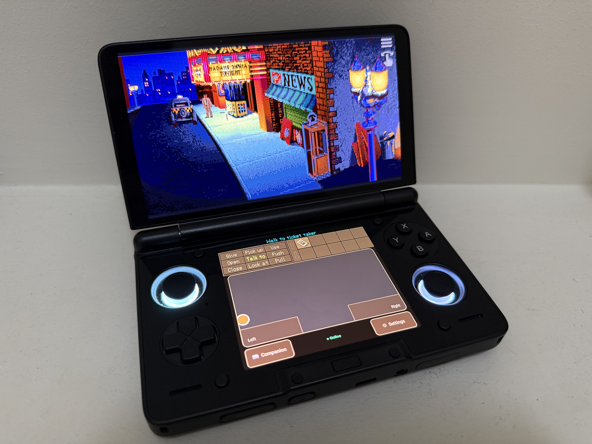
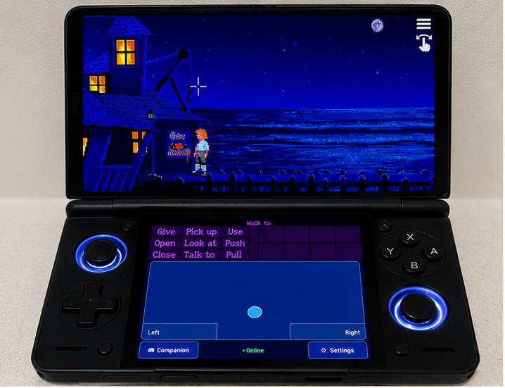
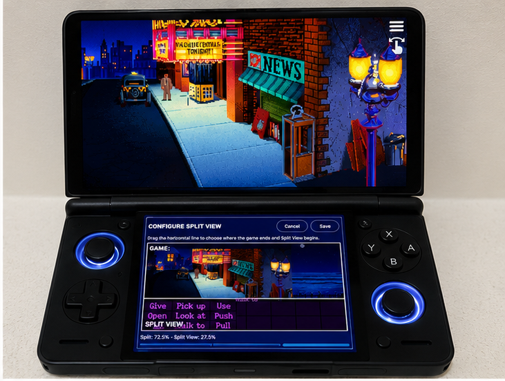
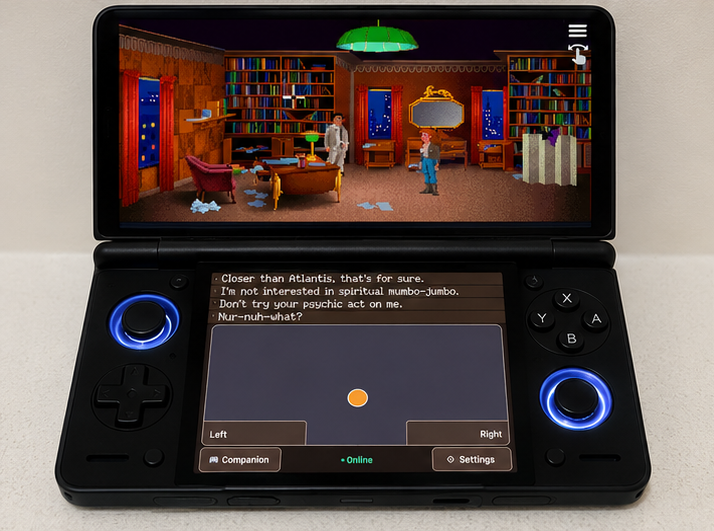
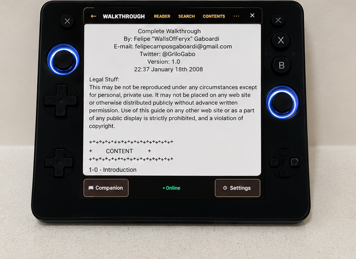

  

# AdventurePad

Transform your AYN Thor into the ultimate dual-screen ScummVM handheld.

AdventurePad is a native Android companion application that transforms the AYN Thor into a true dual-screen adventure gaming device.

While ScummVM runs uninterrupted on the upper display, AdventurePad provides a dedicated lower-screen interface featuring a precision touchpad, walkthrough reader, game notes, controller shortcuts, and game-specific companion tools.

Designed specifically for classic point-and-click adventures, AdventurePad aims to recreate the feel of a modern Nintendo DS-style experience while preserving the original ScummVM engine.

# Current Features

## Highlights

- 🎮 Native dual-screen experience for the AYN Thor
- 🖱️ Precision touchpad with controller integration
- 📖 Built-in walkthrough reader
- 📝 Per-game notes
- ✂️ Adjustable split-view editor with per-game profiles
- 🎨 Theme support and future skinning foundation

## Gallery

<table>
  <tr>
    <td align="center" width="50%">
       
      <b>🎮 Dual-Screen Gameplay</b> 
      Dedicated lower-screen controls while the game stays on the upper display.
    </td>
    <td align="center" width="50%">
       
      <b>✂️ Split View Editor</b> 
      Adjust the interface split and save the layout for each game.
    </td>
  </tr>
  <tr>
    <td align="center" width="50%">
       
      <b>💬 Interactive Dialogues</b> 
      Keep dialogue choices on the lower display while gameplay continues above.
    </td>
    <td align="center" width="50%">
       
      <b>📖 Built-in Walkthroughs</b> 
      Read game guides directly on the second screen without leaving ScummVM.
    </td>
  </tr>
</table>

## Dual Display

- ✅ Live mirrored ScummVM rendering on the secondary display
- ✅ Dynamic Split View with adjustable horizontal split
- ✅ Full-width cropped game interface rendered on the lower display
- ✅ Independent upper game / lower interface rendering
- ✅ Per-game Split View profiles
- ✅ Automatic migration from legacy crop profiles
- ✅ Persistent Split View / Trackpad mode
- ✅ Automatic secondary display detection
- ✅ Automatic ScummVM connection
- ✅ Automatic mirror surface recreation after display reconnect
- ✅ Restore Both Screens recovery

---

## Split View Editor

- Smooth drag-to-adjust horizontal split
- Fine adjustment controls
- Live preview
- Save / Cancel workflow
- Normalized split storage
- Versioned profile persistence
- Per-game restoration using the ScummVM target ID

---

## Input

### Touch

- Large relative touch trackpad
- Single tap left click
- Two-finger right click
- Double-tap-and-hold drag
- Dedicated Left / Right mouse buttons

### Controller

- Left stick → mouse cursor
- A → Left click
- B → Right click
- Two-finger double tap shortcut for mode switching
- L2 + R2 shortcut for Split View / Trackpad mode switching
- Normal trigger behaviour preserved outside the shortcut

---

## Cursor System

- Continuous cursor ownership across both displays
- Cursor rendered only on its owning display
- Upper display owns rows above the split
- Lower display owns the split row and everything below
- Cursor coordinates transformed correctly into the lower cropped surface
- No duplicated cursor rendering

---

## Rendering

- Exact complementary upper/lower rendering regions
- Aspect-ratio preserved lower interface panel
- Dynamic panel height based on split position
- Full-width rendering without distortion
- Surface generation tracking
- Safe mirror surface recreation
- TextureView host implementation available for experimentation
- Existing SurfaceView implementation retained

---

## Reliability

- Robust mouse ownership system preventing duplicate DOWN / UP events
- Generation-safe mirror attachment lifecycle
- Safe mirror surface recreation
- Crop generation tracking
- Automatic recovery after display reconnects
- Regression tests covering repeated mirror recreation

---

# Tested

## Hardware

- ✅ AYN Thor dual-screen Android handheld

## Games

- Indiana Jones and the Fate of Atlantis
- Beneath a Steel Sky

---

# Project Status

## Milestone

# ✅ Split View Milestone Complete

AdventurePad now provides:

- Live dual-display rendering
- Adjustable Split View
- Per-game split persistence
- Independent touch trackpad
- Controller shortcuts
- Live lower interface rendering
- Reliable mirror recreation
- Hardware validation on the AYN Thor

The original proof-of-concept objective has been achieved.

---

# Known Issues

### L2 + R2 after game launch

Immediately after launching a game, the L2 + R2 Split View shortcut does not activate until the lower display has received focus.

The shortcut also stops working if focus returns to the upper display (for example by touching the upper touchscreen).

This is believed to be an Android input focus issue rather than a rendering issue.

Current workaround:

- Touch the lower display once.
- L2 + R2 then functions normally.

This issue is intentionally deferred for a future milestone.

---

# Planned Work

## User Experience

- Adventure-themed interface
- Improved UI polish
- Community themes
- Animated transitions

## Gameplay

- Per-game lower-screen layouts
- Context-sensitive action panels
- Notes system
- Hint system
- Two-finger scrolling
- Additional gesture shortcuts

## Technical

- Resolve Android display-focus dependency for controller shortcuts
- Evaluate TextureView vs SurfaceView performance
- Reduce rendering latency where possible
- Additional hardware compatibility testing
- Upstream investigation into ScummVM integration

---

# Building

...