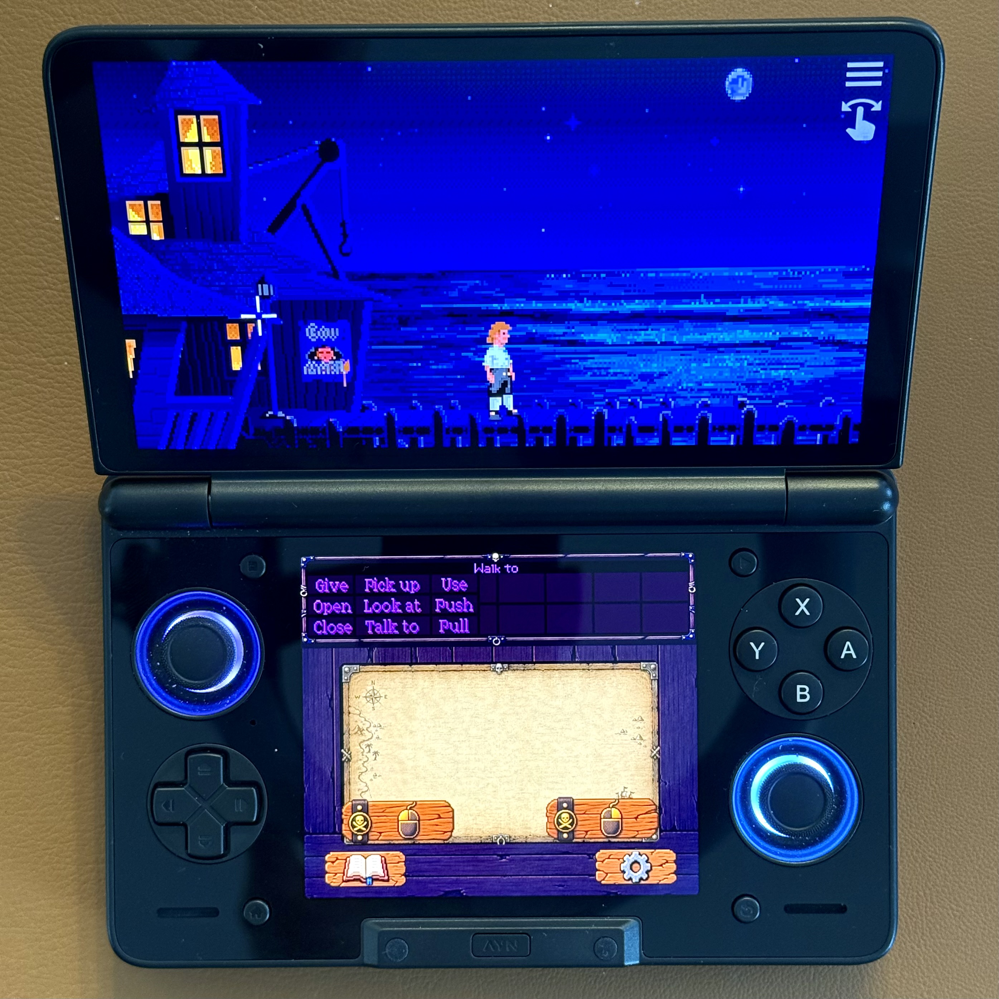
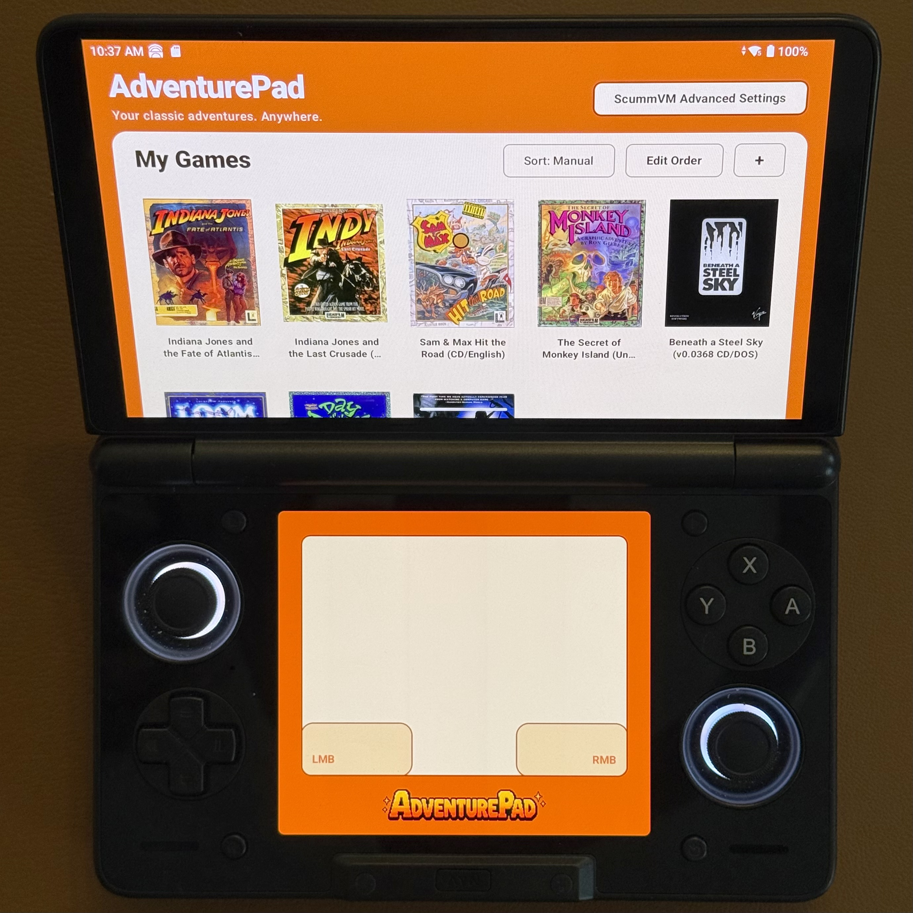
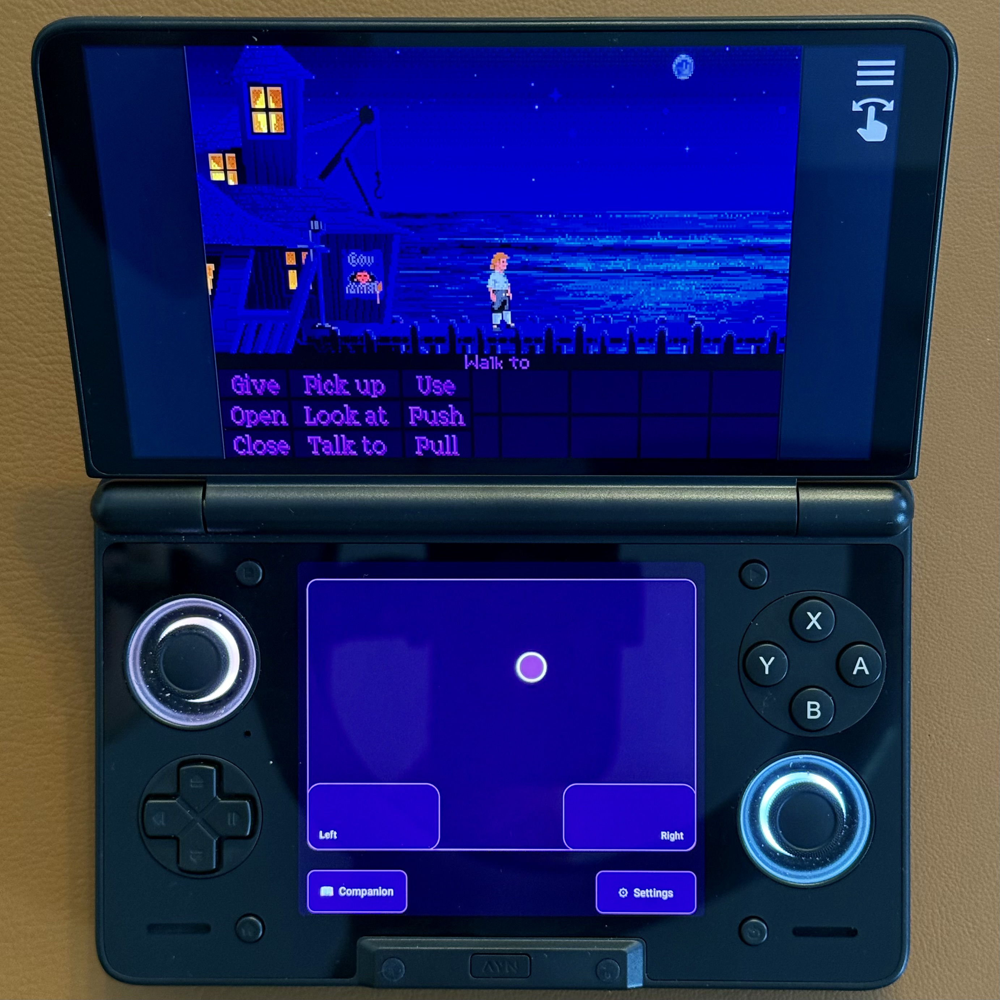
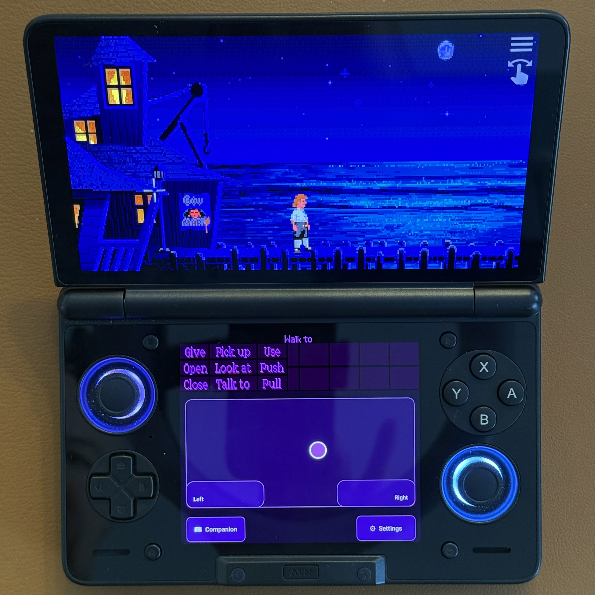
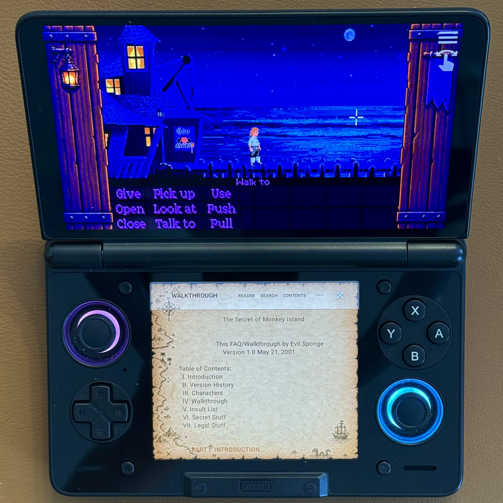

# AdventurePad

AdventurePad is a dual-screen companion for [ScummVM](https://www.scummvm.org/) designed for the AYN Thor. It turns the second display into a launcher, relative trackpad, controls, Split View, Notes and Walkthrough companion, colour-themed interface, and immersive per-game skins.

## What it does

- AdventurePad launcher and game library
- Neutral bundled game artwork, private user-managed artwork overrides, and Play, Resume, and Load Game actions
- Relative touchscreen trackpad with LMB/RMB controls
- Trackpad and Split View modes
- Per-game Notes and Walkthrough reader
- 15 Colour Themes, including a light Daylight theme
- Immersive custom Skins made from one PNG
- Per-game display, interface, and skin settings
- Touch gestures and controller support

## Screenshots

<table>
  <tr>
    <td align="center" width="50%">
       
      Browse configured ScummVM games from the AdventurePad launcher.
    </td>
    <td align="center" width="50%">
       
      Use the lower display as a relative trackpad with dedicated mouse controls.
    </td>
  </tr>
  <tr>
    <td align="center" width="50%">
       
      Move the lower part of the game interface onto the second display.
    </td>
    <td align="center" width="50%">
       
      Keep a walkthrough available on the lower display without leaving the game.
    </td>
  </tr>
  <tr>
    <td align="center" colspan="2">
       
      Choose from built-in Colour Themes for AdventurePad's native interface.
    </td>
  </tr>
</table>

## Requirements

- An **AYN Thor**, the intended and tested platform
- Android 13 or newer
- A second screen exposed by Android as a presentation display
- The matching AdventurePad custom ScummVM APK

The stock ScummVM Android app cannot replace the matching custom build: AdventurePad relies on a private, signature-protected bridge between the two APKs. Other dual-display Android devices may satisfy the same architecture, but they are unverified and unsupported. Ordinary single-screen Android devices are not supported.

## Installation

1. Download a matching two-APK AdventurePad release.
2. Install both the AdventurePad and custom ScummVM APKs from that release.
3. Launch AdventurePad.
4. Choose **Add Game** and select your legally obtained, ScummVM-compatible game data.

AdventurePad does not include commercial games. See the [installation guide](docs/INSTALLATION.md) for updates, signing requirements, and troubleshooting.

## Custom skins

The public workflow is deliberately simple:

**production template → artwork → one 4720×4040 PNG → import into AdventurePad**

Start with the [production template](skin-authoring/AdventurePad-Skin-Template-v2.png), consult the [annotated reference](skin-authoring/AdventurePad-Skin-Template-v2-reference.png), view the [completed Pirate example sheet](skin-authoring/AdventurePad-Skin-Example.png), and follow the [custom-skin guide](docs/CUSTOM_SKINS.md) or [technical reference](docs/SKIN_REFERENCE.md). The optional large editable PSD is intended for a downloadable Creator Pack rather than normal Git history.

Colour Themes style AdventurePad's native **Standard** interface. A per-game custom Skin is a separate system; choosing **Immersive** presentation can extend authored artwork across both the gameplay surround and lower interface.

## Documentation

- [Installation](docs/INSTALLATION.md)
- [Features](docs/FEATURES.md)
- [Custom Skins](docs/CUSTOM_SKINS.md)
- [Skin Reference](docs/SKIN_REFERENCE.md)
- [Building](docs/BUILDING.md)
- [Known Limitations](docs/KNOWN_LIMITATIONS.md)
- [Changelog](CHANGELOG.md)
- [Licensing](#licensing)

## Project status

AdventurePad is under active development and remains preview/pre-stable software. The current development source contains newer functionality than the [latest published preview release](https://github.com/smnw4ck8yf-coder/AdventurePad/releases); read a release's notes before assuming that its APKs include every feature described here.

## Community and feedback

- Report bugs or request features in [GitHub Issues](https://github.com/smnw4ck8yf-coder/AdventurePad/issues).
- Share ideas and questions in [GitHub Discussions](https://github.com/smnw4ck8yf-coder/AdventurePad/discussions).
- Join the community at [r/AdventurePad](https://www.reddit.com/r/AdventurePad/).

Potential contributors are welcome to explore the source and documentation.

## Licensing

AdventurePad-authored source code is licensed under the [Apache License 2.0](LICENSE). First-party reusable skin-authoring templates, Creator Pack documentation/art assets, and the AdventurePad Pirate example artwork are available under [CC BY 4.0](CREATOR_ASSETS_LICENSE.md).

Those licenses do not change or override the licenses and rights that apply to ScummVM, third-party libraries, third-party assets, commercial games, screenshots, or trademarks. AdventurePad includes neutral first-party launcher title cards rather than redistributed commercial box artwork; see the [bundled artwork note](docs/BUNDLED_ARTWORK.md).

## ScummVM relationship

AdventurePad uses a modified ScummVM build to provide its dual-display and control bridge. [ScummVM](https://www.scummvm.org/) is a separate upstream open-source project, and AdventurePad is not an official ScummVM project. The compatible source fork currently exists alongside this project during development; its public repository link will be added when available. For the present build and integration details, see [Building AdventurePad](docs/BUILDING.md).
