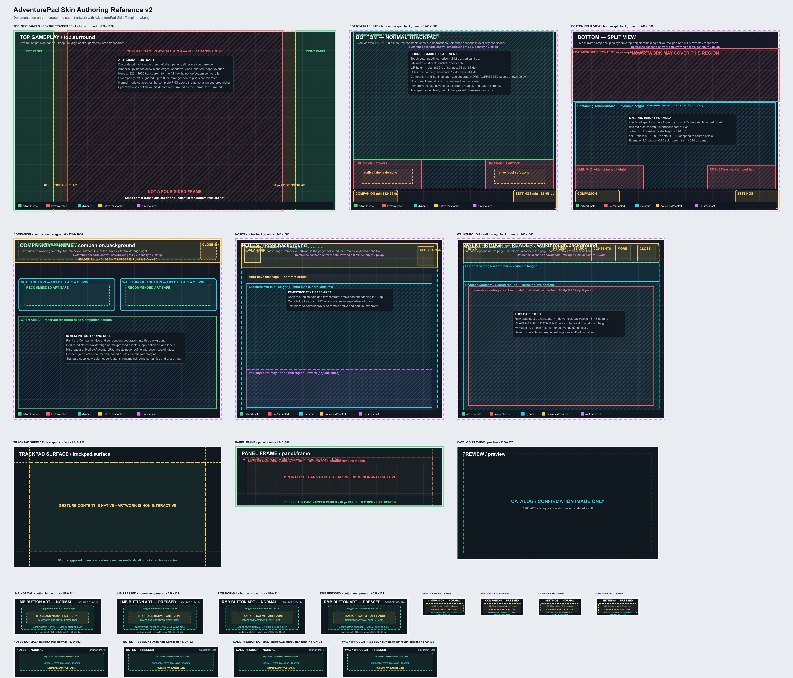
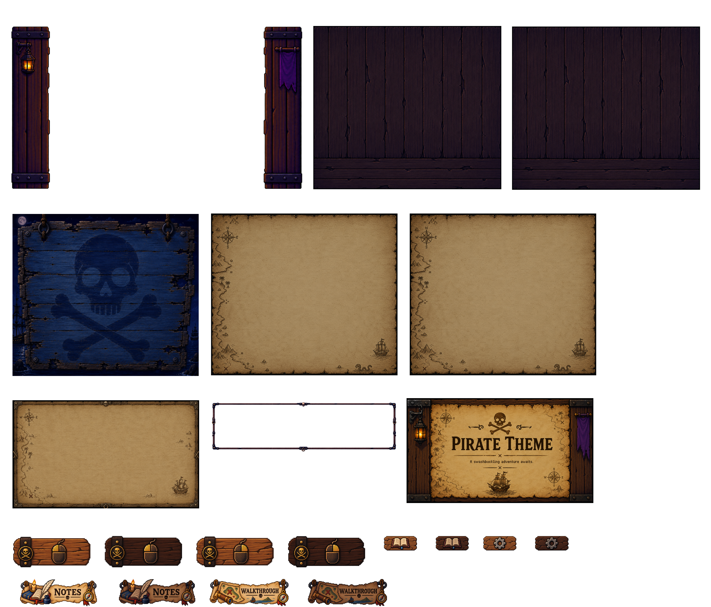

# Creating a Custom AdventurePad Skin

The first-party AdventurePad template material, Creator Pack documentation/art assets, and Pirate example artwork are reusable under [CC BY 4.0](../CREATOR_ASSETS_LICENSE.md). The license note explains scope, attribution, and exclusions.

AdventurePad imports **one 4720×4040 PNG**. That one sheet contains 21 artwork regions; AdventurePad validates it, cuts out the regions, creates the internal skin package, and installs the Skin automatically.

> **AdventurePad imports one 4720×4040 PNG — not the PSD and not 21 separate images.**

## What you need

- AdventurePad and its matching compatible custom ScummVM app on an AYN Thor
- An image editor that can preserve a 4720×4040 pixel canvas and PNG transparency
- The [production template](../skin-authoring/AdventurePad-Skin-Template-v2.png) and [annotated reference](../skin-authoring/AdventurePad-Skin-Template-v2-reference.png)
- Optionally, `AdventurePad-Skin-Template.psd` from the downloadable Skin Creator Pack

The PSD-compatible editable template was created in Affinity and is intended for use in compatible image editors. It is a convenience, not the AdventurePad import format. Editors that do not support PSD can use the tracked PNG or SVG templates instead.

## The basic idea

The large sheet is a registration canvas. Each marked rectangle has one job: an upper surround, a lower-screen background, a scalable surface or frame, a catalog preview, or one state of a button. Keep each piece of artwork in its intended rectangle and keep the canvas at its original size. AdventurePad reads the positions from its canonical authoring specification and does the slicing and packaging for you.

You do **not** create manifests, hashes, asset folders, ZIP files, `.apskin` packages, or skin IDs.

## Choose your starting point

### Option 1: the editable PSD

The Creator Pack PSD includes the template/reference and a completed first-party AdventurePad Pirate example. Its actual top-level structure is:

- `Background` — the template/reference guide; visible by default
- `EXAMPLE` — a completed example flattened into its own pixel layer; visible by default

Both layers can be toggled independently. There is no pre-made `YOUR ARTWORK` layer. Create a new artwork layer beneath `Background`, then hide `EXAMPLE` while making a new skin. Keeping `Background` visible while you work lets its labels and guides sit over your artwork. Hide `Background` before the final export.

The Pirate example demonstrates one possible treatment: full-height side panels around gameplay, wood lower-screen backgrounds, parchment reader backgrounds, related normal/pressed controls, and an opaque catalog preview. It is an example, not a required style.

### Option 2: PNG or SVG templates

Use the [production PNG](../skin-authoring/AdventurePad-Skin-Template-v2.png) or [production SVG](../skin-authoring/AdventurePad-Skin-Template-v2.svg) as the exact-size starting canvas. Keep the [annotated PNG](../skin-authoring/AdventurePad-Skin-Template-v2-reference.png) or [annotated SVG](../skin-authoring/AdventurePad-Skin-Template-v2-reference.svg) open as a placement reference.

The machine-readable geometry authority is always [`AUTHORING_TEMPLATE_SPEC.json`](../skin-authoring/AUTHORING_TEMPLATE_SPEC.json). The PSD and visual templates help creators; they do not redefine coordinates.

## See the progression

| Template/reference | Completed artwork sheet | Result on an AYN Thor |
| :---: | :---: | :---: |
|  |  |  |

The completed sheet contains AdventurePad's first-party Pirate example artwork only. It does not include commercial game artwork and does not imply association with or endorsement by a game publisher.

## Understand the 21 regions

Learn them by function first. The [Skin Authoring Reference](SKIN_REFERENCE.md) has every exact coordinate.

### Upper gameplay

- `top.surround` — transparent decoration around the upper gameplay display

Think primarily in terms of two full-height decorative side panels. Keep the large central gameplay area transparent and avoid meaningful horizontal framing through its top or bottom. Small transition artwork may extend inward toward the game edges. In normal gameplay, authored alpha can overlay the extreme game edges; AdventurePad does not simply clip the entire surround out of the viewport. Split View does not present this whole decorative surround in the same way.

The 1920×1080 output uses these local coordinates:

- primary side artwork: `x=0…240` and `x=1680…1920`
- transition/overlap bands: `x=240…320` and `x=1600…1680`
- safe centre: `x=320…1600`, full height

For validation, alpha values at or below 32 are ignored. No more than 0.5% of safe-centre pixels may have alpha above 32.

### Lower backgrounds

- `bottom.trackpad.background` — behind Trackpad Mode
- `bottom.split.background` — behind the live, runtime-sized Split View mirror

Both outputs are 1240×1080. Do not paint a fixed mirror opening into the Split background; AdventurePad places the live mirror above it responsively.

### Companion and readers

- `companion.background` — the Companion landing surface
- `notes.background` — behind native Notes content
- `walkthrough.background` — behind native Walkthrough content

These outputs are also 1240×1080. Preserve quiet, readable space for responsive native content, especially on the Notes and Walkthrough pages. The Pirate example uses wood and parchment, but your layout and visual style can be entirely different.

### Trackpad and Split View frame

- `trackpad.surface` — a responsive, nine-sliced touch surface; 1240×720 with 96 px insets
- `panel.frame` — the border around live lower mirrored Split View content; 1240×360 with 64 px insets

Source dimensions are authoring dimensions, not fixed rendered sizes or touch geometry. AdventurePad scales and composes these assets responsively. Keep essential decoration away from areas likely to stretch.

The importer intentionally clears the `panel.frame` centre at `x=64`, `y=64`, `w=1112`, `h=232`. Put frame artwork around the edges. This frame belongs to the live lower mirror in Immersive Split View; it is **not** a Companion overlay frame.

### Catalog preview

- `preview` — the 1200×675 catalog and import-confirmation image

Every preview pixel must be fully opaque. The preview represents the Skin in catalog/confirmation UI; it is not a transparency-based gameplay layer.

### Mouse controls

- `button.lmb.normal` and `button.lmb.pressed`
- `button.rmb.normal` and `button.rmb.pressed`

Each is 528×224 with a 48 px nine-slice inset.

### Small controls

- `button.companion.normal` and `button.companion.pressed`
- `button.settings.normal` and `button.settings.pressed`

Each is 264×112 with a 24 px nine-slice inset.

### Companion choices

- `button.notes.normal` and `button.notes.pressed`
- `button.walkthrough.normal` and `button.walkthrough.pressed`

Each is 572×192 with a 32 px nine-slice inset.

For every pair, `normal` is the default appearance and `pressed` is the touch-down/active appearance. Keep the two visually related, and keep important icons or text away from stretch-sensitive borders. These image dimensions do not define runtime hit targets.

## Step-by-step workflow

1. Open the PSD, production PNG, or production SVG without changing its 4720×4040 canvas.
2. Study the annotated reference and, if using the PSD, inspect the visible `EXAMPLE` layer.
3. Hide `EXAMPLE` before making your own skin.
4. Create a new artwork layer beneath the PSD's `Background` guide, or use equivalent layers in your editor.
5. Design `top.surround` as left and right decoration while keeping its gameplay-safe centre transparent.
6. Design separate Trackpad and Split backgrounds.
7. Design the Companion, Notes, and Walkthrough backgrounds, leaving readable space for native content.
8. Design the responsive trackpad surface and the border-only Split View panel frame.
9. Create related normal and pressed artwork for LMB, RMB, Companion, Settings, Notes, and Walkthrough.
10. Create a fully opaque catalog preview.
11. Hide the PSD's `Background` guide (or every guide, label, registration, and reference layer in another template). Hide or replace the example so only intended artwork remains.
12. Export **one PNG at exactly 4720×4040 pixels**. Do not crop, resize, or export regions separately.
13. Transfer that PNG to the Android device.
14. With the game running, open AdventurePad **Settings**, choose **Game skin**, choose **ADD SKIN**, and select the PNG.
15. After validation and installation, choose **APPLY** in the **Skin added** dialog. Alternatively, keep it installed and select it later under **Settings → Game skin**.
16. Skin selection requests the **Immersive** interface style. If needed, open **Colour theme** in Settings and select **Immersive**.

## Export checklist

Your final import file must be:

- PNG
- exactly 4720×4040 pixels
- still on the full original canvas
- transparent where the authoring rules require transparency

DPI is irrelevant to AdventurePad validation. sRGB is recommended for predictable colour but is not importer-enforced.

Before export, confirm that the guide/template is hidden, the Pirate example is hidden or replaced, only your intended artwork is visible, and the preview is opaque. Do not export the PSD. Do not export 21 individual images.

## What AdventurePad does on import

AdventurePad verifies that the selected file is a readable PNG of the correct size, checks protected transparency and preview opacity, crops all 21 regions, clears the Split panel's centre, writes internal metadata and hashes, creates the internal package, and installs the resulting Skin. Those packaging details are automatic.

## Troubleshooting and current limitations

- **Wrong dimensions:** restore the exact 4720×4040 canvas; do not resize or trim it.
- **Catalog image error:** make every pixel in the `preview` rectangle opaque.
- **Gameplay-safe area error:** remove opaque artwork from the central area of `top.surround`.
- **Unreadable or unsupported file:** export a normal PNG and select that file, not the PSD.
- **Already installed:** identical source PNGs produce the same hash-derived Skin identity. Re-importing the identical PNG is rejected, and there is currently no public replace/update workflow. Change the source artwork, export again, or remove the installed Skin before re-importing the identical file.

For exact crop coordinates, scaling modes, protected areas, and nine-slice values, continue to the [Skin Authoring Reference](SKIN_REFERENCE.md). For additional component guides, see the [Skin Creator Kit](../skin-creator-kit/README.md).
