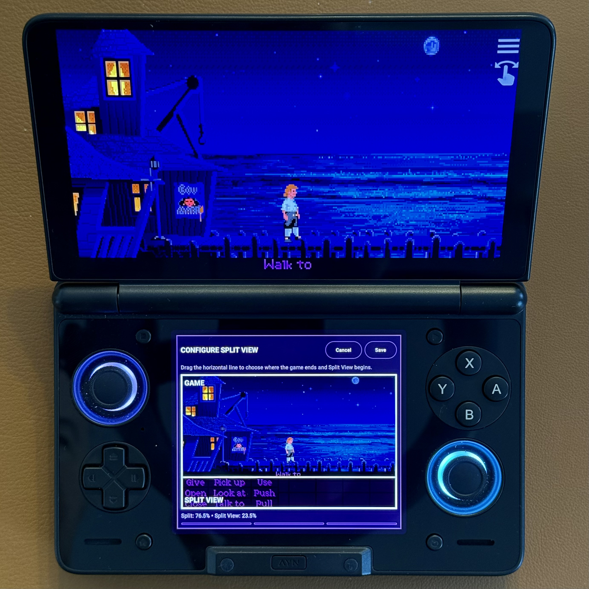
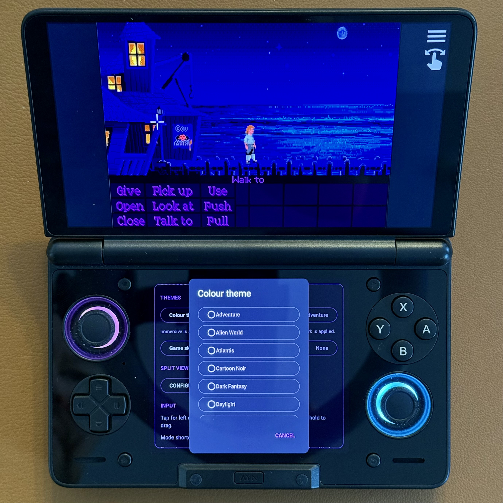

# Features

This page describes the current development source. The [latest published preview](https://github.com/smnw4ck8yf-coder/AdventurePad/releases) may not yet contain every feature listed here.

## Launcher and library

AdventurePad reads configured targets from the matching custom ScummVM app and presents them as game cards with available artwork. From the launcher you can:

- **Play** a game.
- **Resume** from the latest save when ScummVM reports one valid, unambiguous latest-save slot.
- **Load Game** through ScummVM's save chooser.
- **Remove Game** from the ScummVM configuration. This does not delete game data or save files.
- **Add Game** through ScummVM's game-detection and folder-selection flow.
- **Set Custom Artwork** for a game card using a PNG, JPEG, or WEBP image. Imported artwork is copied into AdventurePad's private storage and can be replaced or removed from the same context menu.

The library supports **Manual**, **Alphabetical**, and **Recently Played** sorting. Manual order and launch timestamps persist. The selected sort mode itself is currently screen state and should not be expected to survive process death.

## Trackpad and mouse controls

The lower touchscreen can act as a relative trackpad:

- Move one finger to move the pointer relatively.
- Tap once for a left click.
- Tap with two fingers for a right click.
- Double-tap and hold to drag.
- Hold the dedicated LMB or RMB control while moving to drag with that button.
- Move two fingers vertically to scroll.

Pointer speed options are **0.5×**, **0.75×**, **1×**, **1.25×**, **1.5×**, and **2×**.

## Controller input

- **A** acts as LMB.
- **B** acts as RMB.
- Controller axes and buttons are forwarded to ScummVM as appropriate.
- **L2+R2** toggles between Trackpad and Split View.

Behavior across every possible Android focus and window state is still undergoing physical-device validation; see [Known Limitations](KNOWN_LIMITATIONS.md).

## Trackpad Mode

Trackpad Mode provides the full lower-screen trackpad and control interface. It is also the compatibility fallback when Split View cannot use a valid connection or saved crop.

## Split View

Split View mirrors a configurable lower portion of the game or interface on the bottom display while the complementary upper portion remains on the top display. The split position is saved per game, and the lower mirror accepts direct touch.

If its configuration or ScummVM connection is unavailable or invalid, AdventurePad falls back to Trackpad Mode.

   
  Split View can be positioned per game using the visual configuration screen.

## Companion

The Companion area currently provides two per-game tools:

- **Notes**
- **Walkthroughs**

Manual, Dialogue, Statistics, and time-played tools are not currently available.

## Notes

Notes are stored per game, auto-saved as you edit, and limited to **100,000 characters**. Selected passages from a Walkthrough can be appended to the current game's Notes.

## Walkthrough reader

Add a Walkthrough by pasting text or importing a `.txt`, `.md`, or `.markdown` file. The current verified limit is **5,000,000 characters**.

The reader provides:

- Parsed headings and structured contents navigation
- Case-insensitive search with previous/next result controls
- Remembered reading position
- Text selection and **Save to Notes**
- Replace and remove actions
- Sans, serif, and monospace fonts
- Small, default, and large text sizes
- Seven reader backgrounds: Default, Black, Dark grey, Light, Beige, Tan, and Warm

A line-spacing value is retained internally, but there is no line-spacing control in the current interface.

## Colour Themes

Colour Themes style AdventurePad's native interface. The 15 themes, in their canonical order, are:

1. Default
2. Adventure
3. Alien World
4. Atlantis
5. Cartoon Noir
6. Dark Fantasy
7. Daylight
8. Enchanted
9. Highway
10. Horror
11. Mansion
12. Ocean
13. Purple Adventure
14. Sorcerer
15. Tentacle Lab

**Daylight** is the light theme. Colour Themes are separate from immersive artwork Skins.

   
  Select a Colour Theme for AdventurePad's native interface.

## Immersive Skins

Skins are per-game artwork packs created by importing one master PNG. A game's interface can use **Standard** style, which retains AdventurePad's native presentation, or **Immersive** style, which uses suitable authored artwork more extensively.

Immersive selection is safety-gated to external skins that provide the required assets. Depending on the supplied artwork, a skin can style the upper gameplay surround, Trackpad Mode, Split View panel, Companion, Notes, Walkthrough, and control states. External skins do not currently reskin the launcher.

See [Creating Custom Skins](CUSTOM_SKINS.md) and the [Skin Authoring Reference](SKIN_REFERENCE.md).

## Persistence

AdventurePad persists these global choices:

- Colour Theme
- Pointer speed
- Default Trackpad/Split View preference

It persists these settings per game where applicable:

- Standard or Immersive interface style
- Assigned skin
- Split View crop
- Notes
- Walkthrough document, reading position, and reader preferences
- Custom launcher artwork, keyed by the exact ScummVM target ID

See also: [Installation](INSTALLATION.md) · [Known Limitations](KNOWN_LIMITATIONS.md)
